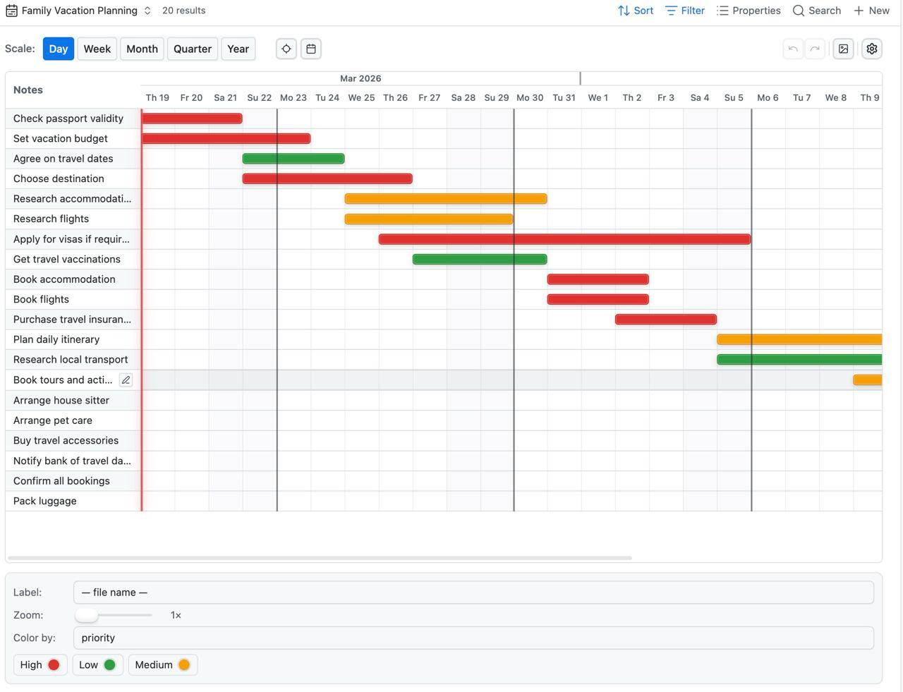

# Timeline for Bases

A Gantt-style timeline view for [Obsidian Bases](https://obsidian.md/bases).

---

## The Story

This plugin was 100% vibe coded.

Not in the "throw a prompt at ChatGPT and paste the result" sense — but in the real spirit of it: a casual, back-and-forth conversation over two days between [TfTHacker](https://x.com/tfthacker) and his [OpenClaw](https://openclaw.ai), an AI assistant he has named Nexus.

No design docs written in advance. No architecture meetings. Just a conversation that started with *"I want a timeline view for Bases"* and evolved, one idea at a time, into something genuinely useful.

The plugin was revised continuously throughout the two days — visual polish, UX tweaks, new features, bug fixes — all through natural conversation. TfTHacker would open Obsidian, look at the result, say what felt off, and the next iteration would appear minutes later.

It's what vibe coding looks like when the goal is something real.

---

## What It Does

Timeline for Bases adds a **Gantt-style timeline view** to Obsidian Bases. Point your base at any folder of notes with date frontmatter and you get a horizontal timeline — by day, week, month, quarter, or year.

### Features

**View & Navigation**
- **5 time scales** — Day, Week, Month, Quarter, Year; switch instantly
- **Today button** — scrolls the timeline to center today in view
- **Jump to date** — date picker popover to scroll directly to any date
- **Zoom** — 1× to 5× zoom slider
- **Today marker** — highlighted line for the current date (Day view)
- **Day separator lines** — faint vertical grid lines mark each day column boundary
- **Week start** — Monday or Sunday, set in plugin settings

**Task Bars**
- **Drag to move** — drag a bar to shift start and end dates; writes back to frontmatter on release
- **Resize** — drag the left or right edge of a bar to adjust start or end date independently
- **Multi-select** — Shift+click to select multiple bars; drag any selected bar to move them all together
- **Right-click context menu** — Open, Edit dates, Duplicate, or Delete directly from the bar
- **Drag between groups** — when the view is grouped, a grip handle appears on each row; drag to any row or group header to reassign the note's group property (frontmatter updated, undoable)
- **Hover preview** — hovering a bar or label shows Obsidian's native page preview popup
- **Double-click bar** — opens the note; single-click the label also opens it

**Editing**
- **Inline label editing** — pencil icon appears on row hover; click to rename the task in place
- **Add task** — creates a new note in the same folder as existing tasks, pre-filled with today's date
- **Undo / redo** — Ctrl+Z / Ctrl+Y (also toolbar buttons); 50-step history

**Display**
- **Color by property** — map any frontmatter value to a color from a theme-adaptive palette
- **Label by property** — choose which frontmatter field appears as the bar label
- **Resizable label column** — drag to adjust width; persisted per view
- **Theme-adaptive colors** — all palette colors are Obsidian CSS variables; they shift with your theme automatically
- **Point tasks** — notes with only a start date render as a single-day marker
- **Grouping and sorting** — handled by Bases natively; the timeline respects whatever grouping you configure

**Other**
- **Export PNG** — captures the current timeline view and saves it to the vault root
- **Create Sample Base** — settings button that generates a "Timeline Sample" folder with 10 vacation-planning tasks and a ready-to-use base
- **Performance** — optimized for large datasets; async chunked rendering, metadata cache pre-filtering, minimal DOM overhead

### Configuration (per view)

Set in the Bases **Configure View** panel:
- **Start date** — frontmatter property for the bar start
- **End date** — frontmatter property for the bar end

Set in the **Config panel** (gear icon in the timeline header):
- **Label** — which property to display on bars
- **Zoom** — scale factor
- **Color by** — property to drive color mapping
- **Color map** — assign colors per unique value

Plugin-wide setting (Settings → Timeline for Bases):
- **Week starts on** — Monday or Sunday

## Install

For testing before the plugin is in the official Obsidian community plugin list, install it with the BRAT plugin:

1. In Obsidian, install and enable **BRAT** ("Beta Reviewers Auto-update Tester").
2. Open **Settings -> BRAT**.
3. Choose **Add Beta plugin**.
4. Paste this repository URL:
   `https://github.com/TfTHacker/timeline-for-bases`
5. Confirm the install and let BRAT download the latest release.
6. Enable **Timeline for Bases** in **Settings -> Community plugins**.

BRAT installs from this repository's GitHub releases, so the tagged release assets must exist for installation to work.

## Releasing

This plugin publishes Obsidian-compatible release assets from a Git tag.

Use this exact flow for a new release:

1. Make sure the working tree is clean:
   `git status`
2. Bump the version:
   `npm version patch`
   or `npm version minor`
   or `npm version major`
3. Push the release commit:
   `git push origin main`
4. Push the tag created by `npm version`:
   `git push origin --tags`
5. GitHub Actions will build the plugin and create a GitHub Release containing:
   - `manifest.json`
   - `main.js`
   - `styles.css`

Notes:

- The Git tag must match the plugin version in `manifest.json` exactly, using Obsidian's required `x.y.z` format.
- Do not use a `v` prefix. Use `0.1.2`, not `v0.1.2`.
- `npm version ...` creates a `vX.Y.Z` tag by default. After running it, replace that tag locally with `X.Y.Z` before pushing.
- `npm version ...` updates `package.json`, `package-lock.json`, and creates the tag.
- The project's `version` script also updates `manifest.json` and `versions.json` automatically.
- The release workflow lives in `.github/workflows/release.yml`.
